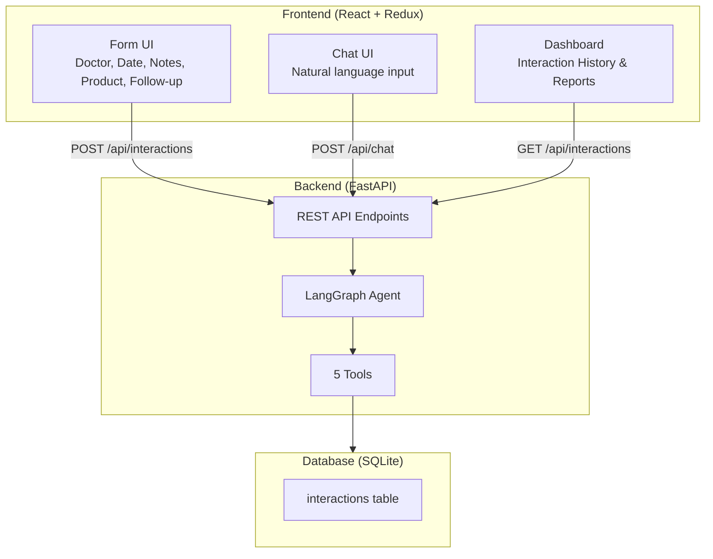
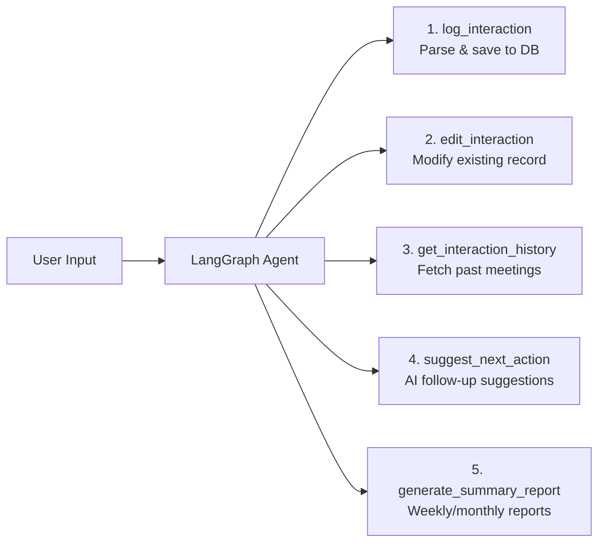

# Healthcare CRM System — Implementation Plan

A mini CRM system for healthcare sales reps to log interactions with doctors (HCPs). Features a **Form UI** and **Chat UI** powered by a LangGraph AI agent with 5 tools.

## Tech Stack

| Layer | Technology |
|-------|-----------|
| Frontend | React + Redux + Vite |
| Backend | FastAPI (Python) |
| AI Agent | LangGraph + Groq LLM (llama3-70b) |
| Database | SQLite (file-based, zero setup) |

> [!IMPORTANT]
> **Database Choice**: Using **SQLite** instead of MySQL/PostgreSQL to avoid requiring you to install and configure a separate database server. SQLite is file-based and works out of the box. The SQL queries and ORM layer are identical — if you later need PostgreSQL, it's a one-line config change. Let me know if you'd prefer PostgreSQL instead.

> [!IMPORTANT]
> **Groq API Key Required**: You'll need a free Groq API key from [console.groq.com](https://console.groq.com). I'll prompt you for this before starting the backend. The key goes in a `.env` file.

---

## Architecture Overview



---

## LangGraph Agent — 5 Tools



| # | Tool | Description |
|---|------|-------------|
| 1 | `log_interaction` | Uses LLM to extract entities (doctor, product, date, notes) from chat text, summarizes, and saves to DB |
| 2 | `edit_interaction` | Modifies an existing interaction record by ID |
| 3 | `get_interaction_history` | Retrieves past interactions, filterable by doctor/date/product |
| 4 | `suggest_next_action` | AI analyzes recent interactions and suggests follow-ups with timing |
| 5 | `generate_summary_report` | Generates weekly/monthly summary reports of all interactions |

---

## Project Structure

```
CRM System/
├── backend/
│   ├── .env                    # Groq API key
│   ├── requirements.txt        # Python dependencies
│   ├── main.py                 # FastAPI app entry point
│   ├── database.py             # SQLAlchemy DB setup + models
│   ├── schemas.py              # Pydantic request/response models
│   ├── agent.py                # LangGraph agent definition
│   ├── tools.py                # 5 LangGraph tools
│   └── crm.db                  # SQLite database file (auto-created)
│
├── CRM SYSTEM/                 # Frontend (existing Vite React app)
│   ├── src/
│   │   ├── main.jsx
│   │   ├── App.jsx
│   │   ├── App.css
│   │   ├── index.css           # Global design system
│   │   ├── store/
│   │   │   └── store.js        # Redux store + slices
│   │   ├── components/
│   │   │   ├── Sidebar.jsx     # Navigation sidebar
│   │   │   ├── FormUI.jsx      # Form-based interaction logging
│   │   │   ├── ChatUI.jsx      # Chat-based AI interaction
│   │   │   ├── Dashboard.jsx   # Interaction history table
│   │   │   ├── InteractionCard.jsx  # Single interaction display
│   │   │   └── ReportView.jsx  # Summary reports
│   │   └── services/
│   │       └── api.js          # API client (fetch wrapper)
│   └── package.json
│
└── README.md                   # Setup & run instructions
```

---

## Proposed Changes

### Backend — FastAPI + LangGraph

#### [NEW] [requirements.txt](file:///c:/Users/hello/OneDrive/Desktop/CRM%20System/backend/requirements.txt)
Python dependencies: `fastapi`, `uvicorn`, `sqlalchemy`, `langchain-groq`, `langgraph`, `langchain-core`, `python-dotenv`, `pydantic`

#### [NEW] [.env](file:///c:/Users/hello/OneDrive/Desktop/CRM%20System/backend/.env)
Template for Groq API key: `GROQ_API_KEY=your_key_here`

#### [NEW] [database.py](file:///c:/Users/hello/OneDrive/Desktop/CRM%20System/backend/database.py)
- SQLAlchemy engine + session factory pointing to `crm.db`
- `Interaction` model: `id`, `doctor_name`, `date`, `notes`, `product_discussed`, `follow_up`, `summary`, `created_at`, `updated_at`
- Auto-create tables on import

#### [NEW] [schemas.py](file:///c:/Users/hello/OneDrive/Desktop/CRM%20System/backend/schemas.py)
- Pydantic models: `InteractionCreate`, `InteractionUpdate`, `InteractionResponse`, `ChatRequest`, `ChatResponse`

#### [NEW] [tools.py](file:///c:/Users/hello/OneDrive/Desktop/CRM%20System/backend/tools.py)
Five LangGraph-compatible tools using `@tool` decorator:
1. `log_interaction` — Parses input, uses LLM for entity extraction & summarization, saves to DB
2. `edit_interaction` — Updates fields of an existing record
3. `get_interaction_history` — Queries DB with optional filters
4. `suggest_next_action` — Analyzes recent data, returns AI suggestions
5. `generate_summary_report` — Aggregates interactions into a report

#### [NEW] [agent.py](file:///c:/Users/hello/OneDrive/Desktop/CRM%20System/backend/agent.py)
- LangGraph `StateGraph` with nodes: `agent` → `tool_calls` → `agent` (loop)
- Uses `ChatGroq` (llama3-70b-8192) as the LLM
- Binds all 5 tools
- System prompt defining the agent as a healthcare CRM assistant

#### [NEW] [main.py](file:///c:/Users/hello/OneDrive/Desktop/CRM%20System/backend/main.py)
FastAPI endpoints:
- `POST /api/chat` — Send natural language to LangGraph agent
- `POST /api/interactions` — Create interaction via form
- `GET /api/interactions` — List all interactions (with filters)
- `PUT /api/interactions/{id}` — Edit interaction
- `DELETE /api/interactions/{id}` — Delete interaction
- `GET /api/reports/summary` — Get summary report
- CORS middleware enabled for frontend

---

### Frontend — React + Redux

#### [MODIFY] [package.json](file:///c:/Users/hello/OneDrive/Desktop/CRM%20System/CRM%20SYSTEM/package.json)
Add dependencies: `redux`, `@reduxjs/toolkit`, `react-redux`, `react-router-dom`, `react-icons`

#### [NEW] [store.js](file:///c:/Users/hello/OneDrive/Desktop/CRM%20System/CRM%20SYSTEM/src/store/store.js)
Redux store with `interactionsSlice`:
- State: `interactions[]`, `loading`, `error`, `chatMessages[]`, `report`
- Async thunks: `fetchInteractions`, `createInteraction`, `sendChatMessage`, `deleteInteraction`, `fetchReport`

#### [NEW] [api.js](file:///c:/Users/hello/OneDrive/Desktop/CRM%20System/CRM%20SYSTEM/src/services/api.js)
Centralized API client with base URL `http://localhost:8000/api`

#### [NEW] [Sidebar.jsx](file:///c:/Users/hello/OneDrive/Desktop/CRM%20System/CRM%20SYSTEM/src/components/Sidebar.jsx)
Navigation: Dashboard, Log Interaction (Form), Chat AI, Reports

#### [NEW] [FormUI.jsx](file:///c:/Users/hello/OneDrive/Desktop/CRM%20System/CRM%20SYSTEM/src/components/FormUI.jsx)
Form with fields: Doctor Name, Date, Discussion Notes, Product Discussed, Follow-up. Dispatches `createInteraction` thunk.

#### [NEW] [ChatUI.jsx](file:///c:/Users/hello/OneDrive/Desktop/CRM%20System/CRM%20SYSTEM/src/components/ChatUI.jsx)
Chat interface: message bubbles, text input. Sends to `/api/chat`, displays AI responses. Shows extracted structured data.

#### [NEW] [Dashboard.jsx](file:///c:/Users/hello/OneDrive/Desktop/CRM%20System/CRM%20SYSTEM/src/components/Dashboard.jsx)
Table of all interactions with search/filter. Edit and delete actions.

#### [NEW] [InteractionCard.jsx](file:///c:/Users/hello/OneDrive/Desktop/CRM%20System/CRM%20SYSTEM/src/components/InteractionCard.jsx)
Card component for displaying a single interaction with all fields.

#### [NEW] [ReportView.jsx](file:///c:/Users/hello/OneDrive/Desktop/CRM%20System/CRM%20SYSTEM/src/components/ReportView.jsx)
Displays AI-generated summary reports with stats and charts.

#### [MODIFY] [index.css](file:///c:/Users/hello/OneDrive/Desktop/CRM%20System/CRM%20SYSTEM/src/index.css)
Complete design system: dark theme, CSS variables, glassmorphism, smooth animations, premium typography (Inter font).

#### [MODIFY] [App.jsx](file:///c:/Users/hello/OneDrive/Desktop/CRM%20System/CRM%20SYSTEM/src/App.jsx)
Router setup with sidebar layout, routes to all pages.

#### [MODIFY] [main.jsx](file:///c:/Users/hello/OneDrive/Desktop/CRM%20System/CRM%20SYSTEM/src/main.jsx)
Wrap app with Redux Provider and BrowserRouter.

---

### Documentation

#### [NEW] [README.md](file:///c:/Users/hello/OneDrive/Desktop/CRM%20System/README.md)
Complete setup instructions:
- Prerequisites (Node.js, Python 3.10+)
- Backend setup (venv, pip install, .env config, run)
- Frontend setup (npm install, run)
- Architecture overview
- API documentation

---

## Verification Plan

### Automated Tests
1. Start backend: `cd backend && python main.py` — verify server starts on port 8000
2. Start frontend: `cd "CRM SYSTEM" && npm run dev` — verify Vite dev server starts
3. Test API endpoints via browser:
   - `GET http://localhost:8000/api/interactions` returns `[]`
   - `POST http://localhost:8000/api/interactions` creates a record
   - `POST http://localhost:8000/api/chat` processes natural language

### Browser Testing
1. Navigate to frontend URL
2. Test Form UI — fill and submit
3. Test Chat UI — type "Met Dr. Sharma, discussed diabetes drug, follow-up next week"
4. Verify interaction appears in Dashboard
5. Test edit/delete functionality
6. Test report generation
